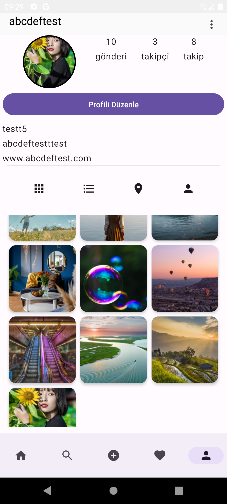

# Fotica App  

Fotica is a modern mobile app where users can share photos, exchange messages and have a social media experience. The application is equipped with an intuitive design and rich features.

---
---
## 📱 **Features**  

### 1. **Home**  
- Users' posts are listed in the **Card** structure.  
- **Card** content:  
  - Profile photo and username  
  - Shared photo  
  - Like and comment buttons, numbers  
  - Post description and sharing time  
- **Comments**: Users can tag other users with `@` and create hashtags with `#` when writing comments.

   
  
  
  

  

---
---
### 2. **Search**  
- The posts of users whose profile is open are listed in a **Grid view**.  
- There is a **search button** at the top, where users can search and access other users' profiles.  
- **Tracking System**:  
  - Non-hidden accounts can be followed.  
  - Follow requests can be sent for hidden accounts.  

   
  
  
  

  

---
---
### 3. **Share**  
- Users can select and share photos (downloads, camera, screenshots) from their devices.  
- Once the photo is selected and shared, the post is listed on the **Home screen**.

   
  
  
  

---
---
### 4. **News**  
- It consists of two tabs:  
  1. **Trend Posts**: Posts with high number of likes are listed.  
  2. **Notifications**: Showing follow requests, follow notifications and like notifications.  

   
  
  

  

---
---
### 5. **Profile**  
- The user's profile is displayed:  
  - Number of followers, followed and posts  
  - Profile photo and posts (in Grid or List view)  
- **Settings**:  
  - Edit Profile (Profile photo, username, biography)  
  - Change Password  
  - Liked Posts  
  - Hide Account  
  - Sign Out  

   
  
  
  

---
---
## 🛠 **Libraries and Tools Used** 
- **Firebase**
- **Gson**
- **Coil**
- **Silicompressor**
- **CameraX**

---
📄License
---
Designed and developed by 2025 Bekir Ahmetli

Licensed under the Apache License, Version 2.0 (the "License");
you may not use this file except in compliance with the License.
You may obtain a copy of the License at

   http://www.apache.org/licenses/LICENSE-2.0

Unless required by applicable law or agreed to in writing, software
distributed under the License is distributed on an "AS IS" BASIS,
WITHOUT WARRANTIES OR CONDITIONS OF ANY KIND, either express or implied.
See the License for the specific language governing permissions and
limitations under the License.
